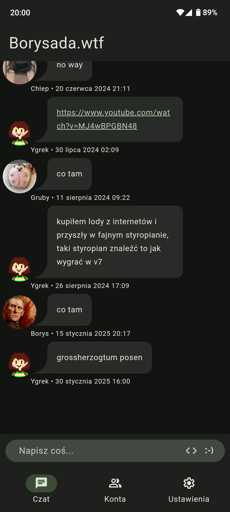
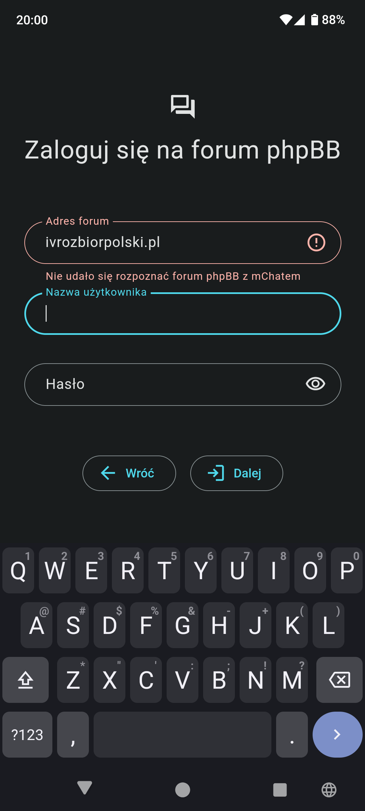

<div align="center">
    <a href="https://github.com/Bilgamesh/mChad">
        
    </a>
    <h1 align="center">mChad</h1>
    <a href="https://github.com/Bilgamesh/mChad/releases">
        
    </a>
    <p align="center">
        A free, mChat client for Android
        <br />
        <div align="center">
            
            
        </div>
        <a href="https://github.com/Bilgamesh/mChad/issues">Report Bug</a>
        ·
        <a href="https://github.com/Bilgamesh/mChad/issues">Request Feature</a>
    </p>
</div>

## Installation

Download the APK from [GitHub Releases](https://github.com/Bilgamesh/mChad/releases) and install it.

## Screenshots

<div align="center">
    
    
    
    
</div>

## Features

- Log into multiple accounts on multiple forums
- Access mChat with mobile-friendly UI
- Get notifications and don't miss any conversations
- Scroll "infinitely" through archived messages

This project is work in progress and does not currently let you use all the features of mChat that are normally available in a web browser. Current experience varies depending on custom bbcodes implemented by specific forum administrators. More features and improved support for phpBB extensions will be added in the near future.

## How to apply your own changes and build this app

This is a Cordova project that can be run in a browser on a computer for ease of development and testing.

## Browser setup

### Install dependencies

```Powershell
npm install -g cordova
npm install
cordova platform add browser
cd proxy-server
npm install
```

### Run a proxy server

When this application is run in a browser, it requires a proxy server to work around same-origin policy preventing the app from accessing external phpBB forums. Proxy server is not required when running the application on Android.

The web version of this application is compatible with [Proxyscotch](https://github.com/hoppscotch/proxyscotch)

```Powershell
docker run -d -p 9159:9159 hoppscotch/proxyscotch
```

### Run mChad

```Powershell
cordova run browser
```

## Android setup

```Powershell
cordova platform add android
```

### Docker

I recommend using Docker to manage Android build tools and eliminate the need for Android Studio

```Powershell
cd cordova-android-builder
docker build -t cordova .
```

### Build .apk

This will create a debug build

```Powershell
npm run build-docker
```

### Install the .apk

If you have your phone connected via ADB, you can simply use this command to install and launch the debug build of this app

```Powershell
npm run start-android
```

Otherwise it's up to you how you want to transfer the APK file.

## Credits

This project utilizes several open-source libraries:

- **[Apache Cordova](https://cordova.apache.org/)**: A platform for building mobile applications using web technologies.

- **[Beer CSS](https://github.com/beercss/beercss)**: A lightweight CSS framework for building material design.

- **[TinyColor](https://github.com/bgrins/TinyColor)**: Fast, small color manipulation and conversion for JavaScript.

- **[Moment.js](https://momentjs.com/)**: A library for parsing and manipulating dates and times.

- **[Viewer.js](https://fengyuanchen.github.io/viewerjs/)**: JavaScript image viewer

- **[cordova-plugin-velda-devicefeedback](https://github.com/VVelda/device-feedback)**: Plugin which provides a way for haptic and acoustic feedback.

- **[cordova-plugin-advanced-http](https://github.com/silkimen/cordova-plugin-advanced-http)**: Cordova / Phonegap plugin for communicating with HTTP servers.

- **[cordova-plugin-navigationbar-color](https://github.com/fagundes/cordova-plugin-navigationbar)**: Cordova NavigationBar Plugin

- **[cordova-plugin-secure-key-store](https://github.com/pradeep1991singh/cordova-plugin-secure-key-store)**: Cordova plugin for securely saving keys, passwords or strings on devices.

- **[cordova-plugin-local-notification](https://github.com/katzer/cordova-plugin-local-notifications)**: Cordova Local-Notification Plugin.

- **[cordova-plugin-background-fetch](https://github.com/transistorsoft/cordova-plugin-background-fetch)**: A plugin that implements background fetching of data.

- **[cordova-plugin-timer](https://github.com/kitolog/cordova-plugin-timer)**: Cordova native timer plugin.

- **[cordova-clipboard-api](https://github.com/wuori/cordova-clipboard-api)**: Clipboard copy and paste plugin for Cordova/PhoneGap that supports text, images and urls for iOS, Android.

- **[cordova-clipboard](https://github.com/ihadeed/cordova-clipboard)**: Clipboard management plugin for Cordova/PhoneGap.

- **[cordova-plugin-theme-detection](https://github.com/mariusbackes/cordova-plugin-theme-detection)**: Cordova plugin to detect whether dark mode is enabled or not.

- **[cordova-plugin-android-permissions](https://github.com/NeoLSN/cordova-plugin-android-permissions)**: Cordova plugin designed for supporting Android permissions checking mechanism.

## License

This project is licensed under the terms of [GPL v3.0 license](https://github.com/Bilgamesh/mChad/blob/main/LICENSE).
