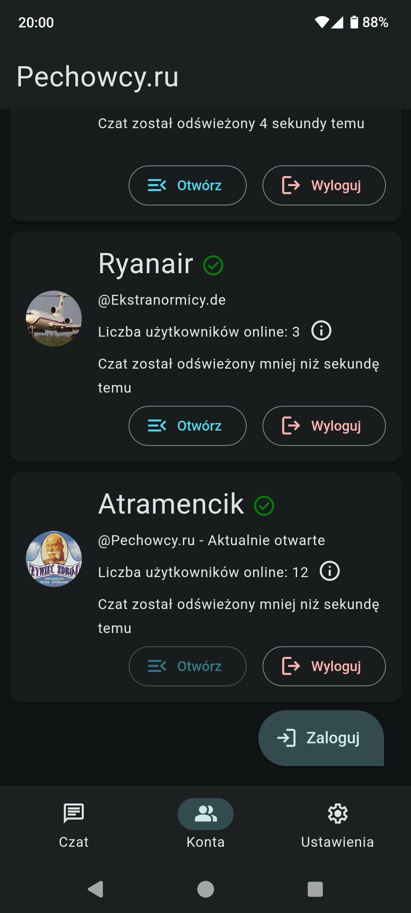
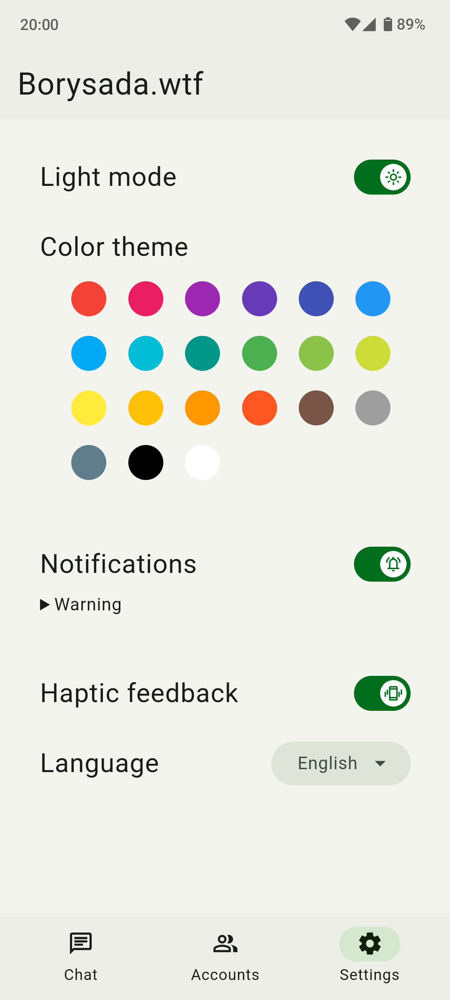

<div align="center">
    <a href="https://github.com/Bilgamesh/mChad">
        
    </a>
    <h1 align="center">mChad</h1>
    <a href="https://github.com/Bilgamesh/mChad/releases">
        
    </a>
    <p align="center">
        A free, mChat client for Android
        <br />
        <div align="center">
            
            
        </div>
        <a href="https://github.com/Bilgamesh/mChad/issues">Report Bug</a>
        ·
        <a href="https://github.com/Bilgamesh/mChad/issues">Request Feature</a>
    </p>
</div>

## Installation

Download the APK from [GitHub Releases](https://github.com/Bilgamesh/mChad/releases) and install it.

## Screenshots

<div align="center">
    
    
    
    
</div>

## Features

* Log into multiple accounts on multiple forums
* Access mChat with mobile-friendly UI
* Get notifications and don't miss any conversations
* Scroll "infinitely" through archived messages

This project is work in progress and does not currently let you use all the features of mChat that are normally available in a web browser. Current experience varies depending on custom bbcodes implemented by specific forum administrators. More features and improved support for phpBB extensions will be added in the near future.

## How to apply your own changes and build this app

This is a Cordova project that can be run in a browser on a computer for ease of development and testing.

## Browser setup

### Install dependencies

```Powershell
npm install -g cordova
npm install
cordova platform add browser
cd proxy-server
npm install
```

### Run proxy-server

This application includes a proxy-server that needs to be run before the application can be used in the web browser. The purpose of this proxy is to work around issues with CORS preventing the app from accessing external phpBB forums.

```Powershell
cd proxy-server
npm start
```

### Run mChad

```Powershell
cordova run browser
```

## Android setup

```Powershell
cordova platform add android
```

### Docker 

I recommend using Docker to manage Android build tools and eliminate the need for Android Studio

```Powershell
docker build -t cordova .
```

### Build .apk

This will create a debug build
```Powershell
npm run build-docker
```

### Install the .apk

If you have your phone connected via ADB, you can simply use this command to install and launch the debug build of this app

```Powershell
npm run start-android
```

Otherwise it's up to you how you want to transfer the APK file.

## License
This project is licensed under the terms of [GPL v3.0 license](https://github.com/Bilgamesh/mChad/blob/main/LICENSE).